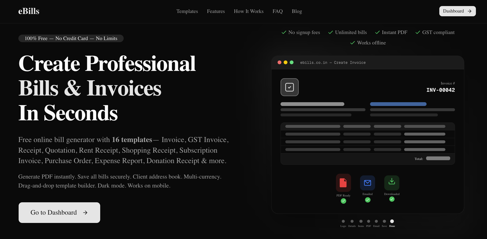
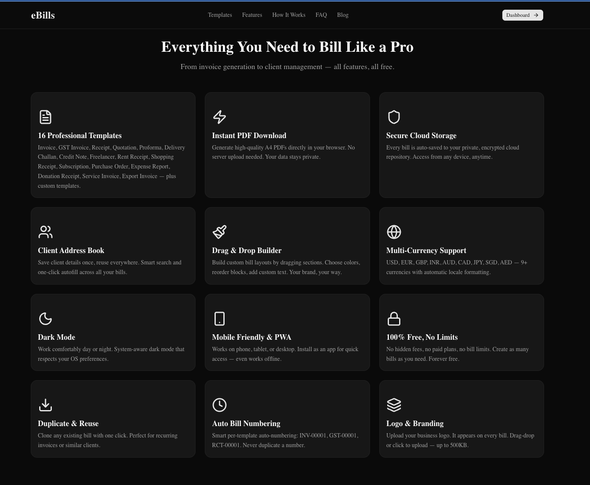
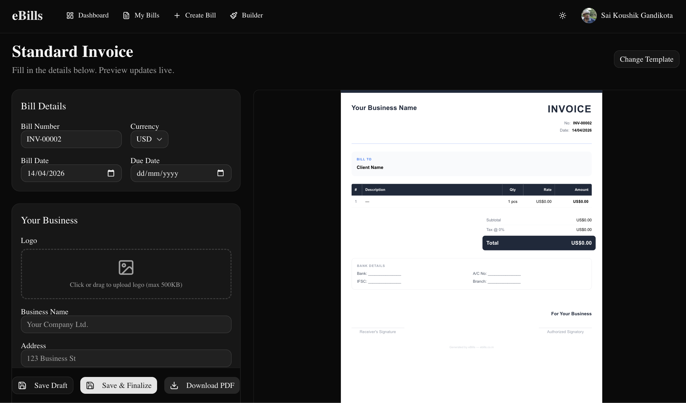
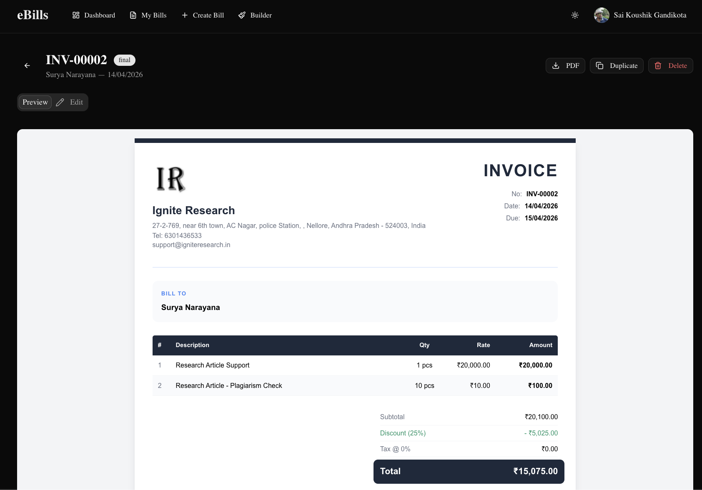
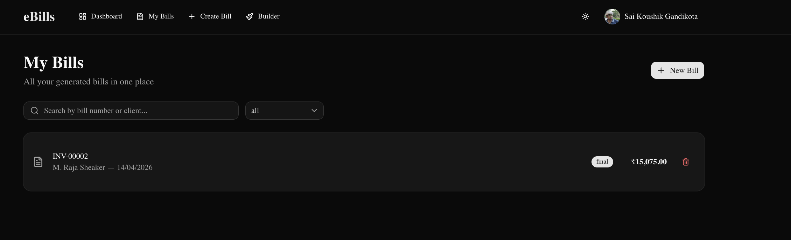

# eBills — Free Online Bill & Invoice Generator

<p align="center">
  <a href="https://ebills.co.in">
    
  </a>
</p>

<p align="center">
  <a href="https://github.com/skgandikota/ebills/stargazers"></a>
  <a href="https://github.com/skgandikota/ebills/fork"></a>
  
  
  
  <a href="https://github.com/skgandikota/ebills/actions"></a>
</p>

> **Zero-cost, serverless billing platform** serving businesses at [ebills.co.in](https://ebills.co.in) build by an Indian with ❤️ for the world 🌍
>
> No servers. No databases. No monthly bills. Just professional invoicing.

<p align="center">
  
</p>

<p align="center">
  <strong>⭐ If you find this useful, please star the repo — it helps others discover it!</strong>
</p>

## Demo

| Landing Page | Bill Editor | PDF Preview | Saved Bills |
|:---:|:---:|:---:|:---:|
|  |  |  |  |

> **Try it live →** [ebills.co.in](https://ebills.co.in) — No signup required to explore templates

---

## Architecture Overview

```
┌─────────────────────────────────────────────────────────────────────┐
│                         CLIENT (Browser)                            │
│                                                                     │
│  Next.js 16 Static Export (App Router)  ←──  GitHub Pages CDN      │
│  ┌──────────┐  ┌──────────┐  ┌──────────┐  ┌───────────────────┐  │
│  │ Bill Form │  │ PDF Gen  │  │ Template │  │ Client Address    │  │
│  │ Editor    │  │ (jsPDF + │  │ Builder  │  │ Book + Logo       │  │
│  │           │  │ canvas)  │  │ (DnD)    │  │ Upload            │  │
│  └──────────┘  └──────────┘  └──────────┘  └───────────────────┘  │
│       │              │              │               │               │
│       └──────────────┴──────┬───────┴───────────────┘               │
│                             │                                       │
│                    Firebase Auth (JWT)                               │
│                    Google │ GitHub SSO                               │
└─────────────────────────────┼───────────────────────────────────────┘
                              │ POST + Bearer <Firebase ID Token>
                              ▼
┌─────────────────────────────────────────────────────────────────────┐
│                  Cloudflare Worker (Token Broker)                    │
│                                                                     │
│  1. Origin validation (ebills.co.in only)                           │
│  2. Firebase JWT verification (RS256 via Google JWKS)               │
│     ├─ Signature, exp, iat, iss, aud, sub                           │
│  3. Derive repo name: ebills-<firebase_uid>                         │
│  4. Ensure private repo exists under ebills-platform org            │
│  5. Return scoped GitHub installation token + repo metadata         │
│                                                                     │
│  Unauthorized? → Random sarcastic 403 response 😏                  │
└─────────────────────────────┼───────────────────────────────────────┘
                              │ Installation Token (scoped)
                              ▼
┌─────────────────────────────────────────────────────────────────────┐
│              GitHub API (User's Private Repository)                  │
│              github.com/ebills-platform/ebills-<uid>                │
│                                                                     │
│  bills/              ← Invoices, receipts, quotations (JSON)        │
│  templates/          ← Custom bill templates                        │
│  assets/             ← Business logos & images                      │
│  metadata.json       ← Preferences, client book, counters          │
│  README.md           ← Auto-generated repo description              │
│                                                                     │
│  Data ownership: 100% user-controlled                               │
│  Encryption: GitHub's enterprise-grade security                     │
│  Portability: Standard JSON files, export anytime                   │
└─────────────────────────────────────────────────────────────────────┘
```

## Key Architectural Decisions

### 1. Zero-Server, Zero-Cost Infrastructure
| Layer | Service | Cost |
|-------|---------|------|
| Frontend Hosting | GitHub Pages | $0 |
| Authentication | Firebase Auth (Google/GitHub SSO) | $0 |
| Token Brokering | Cloudflare Workers (100k req/day free) | $0 |
| Data Storage | GitHub Repos (private, per-user) | $0 |
| CDN & SSL | GitHub Pages + Cloudflare | $0 |
| **Total Monthly** | | **$0** |

No database. No S3 buckets. No EC2 instances. No RDS. No monthly AWS/GCP/Azure bill.

### 2. Data Sovereignty by Design
Unlike conventional SaaS platforms storing user data in shared databases, each user's billing data lives in **their own private GitHub repository**. This design provides:
- **Zero vendor lock-in** — data is portable JSON files
- **User-controlled deletion** — delete the repo, data is gone
- **Survives platform shutdown** — data persists in user's GitHub account
- **Git-powered audit trail** — every change is a commit with timestamp
- **No GDPR data-processor liability** — we never store user data

### 3. Security Architecture (5-Layer Token Broker)
The Cloudflare Worker enforces a strict security pipeline before granting any GitHub API access:

```
Request → Origin Check → Method Check → Bearer Token Check
       → Firebase JWT Verification (RS256 + Google JWKS)
         ├─ Algorithm validation
         ├─ Signature verification against public keys
         ├─ Expiry (exp) & issued-at (iat) validation
         ├─ Issuer (iss) & audience (aud) validation
         └─ Subject (sub) — Firebase UID extraction
       → GitHub token issuance with repo-name isolation
```

Unauthorized requests receive a randomized sarcastic 403 response — because if someone's trying to hack a free invoice generator with zero stored payment data, they deserve to know.

### 4. Per-User Repository Isolation
```
Firebase UID → deterministic repo name → ebills-<sanitized_uid>
```
- Each user gets an isolated private repository under the `ebills-platform` GitHub org
- First-time users get auto-provisioned repos with a seeded README
- GitHub App installation tokens provide API access scoped to the installation
- No cross-user data access is possible — repo names are derived from verified JWTs

### 5. Static-First with Client-Side Hydration
The entire application is a **static export** (`next build` → HTML/CSS/JS files). No Node.js server at runtime.

- Public pages (landing, blog, templates, legal) are pre-rendered at build time
- Dashboard pages hydrate on the client with Firebase Auth state
- PDF generation happens entirely in-browser (jsPDF + html2canvas)
- SEO content (1,095 blog posts, 16 template landing pages) is statically generated

---

## Tech Stack

| Category | Technology | Purpose |
|----------|-----------|---------|
| Framework | Next.js 16 (App Router) | Static site generation + client hydration |
| Language | TypeScript | Type safety across the codebase |
| Styling | Tailwind CSS v4 + shadcn/ui | Utility-first CSS with accessible components |
| Auth | Firebase Auth | Google + GitHub SSO with ID tokens |
| Token Broker | Cloudflare Workers | JWT verification + GitHub token issuance |
| Data Layer | GitHub API (Octokit) | CRUD on user's private repo |
| PDF Engine | jsPDF + html2canvas | Browser-side A4 PDF generation |
| Hosting | GitHub Pages | Free static hosting with custom domain |
| PWA | next-pwa | Installable app with offline support |

---

## Project Structure

```
src/
├── app/
│   ├── page.tsx                    # Landing page (SSG)
│   ├── layout.tsx                  # Root layout + SEO metadata
│   ├── blog/                       # Blog listing + 1,095 post detail pages
│   ├── [slug]/                     # 16 template-specific landing pages
│   ├── dashboard/
│   │   ├── page.tsx                # Dashboard home
│   │   ├── bills/new/page.tsx      # Bill creation (16 templates)
│   │   ├── bills/view/page.tsx     # Bill viewer + edit + duplicate
│   │   ├── builder/page.tsx        # Drag-and-drop template builder
│   │   └── settings/page.tsx       # Business defaults & preferences
│   ├── privacy/                    # Privacy Policy
│   ├── terms/                      # Terms of Service
│   ├── about/                      # About (architecture story)
│   ├── contact/                    # Contact + FAQ
│   └── disclaimer/                 # Legal disclaimer
├── components/
│   ├── auth/                       # AuthProvider, LoginCard
│   ├── builder/                    # BillForm, ClientPicker, LogoUpload, TemplateBuilder
│   ├── templates/                  # BillPreview (16 themed templates)
│   ├── theme/                      # Dark/light mode
│   └── ui/                         # shadcn/ui primitives
├── lib/
│   ├── firebase.ts                 # Firebase Auth init + SSO
│   ├── token-broker.ts             # Cloudflare Worker client + token caching
│   ├── github.ts                   # Octokit CRUD (bills, metadata, templates, assets)
│   ├── pdf.ts                      # jsPDF + html2canvas PDF generation
│   └── templates.ts                # 16 built-in bill template definitions
├── data/
│   ├── blog-posts.ts               # 1,095 SEO blog posts (auto-generated)
│   └── template-pages.ts           # 16 template landing page configs
└── types/
    └── bill.ts                     # TypeScript interfaces for bills, templates, metadata
```

---

## Features

- **16 Bill Templates** — Standard Invoice, GST Invoice, Proforma, Receipt, Quotation, Delivery Challan, Credit Note, Freelancer Invoice, Rent Receipt, Shopping Receipt, Subscription Invoice, Purchase Order, Expense Report, Donation Receipt, Service Invoice, Export Invoice
- **Drag-and-Drop Template Builder** — Create custom bill layouts
- **Client Address Book** — Save clients, one-click autofill
- **Business Logo Upload** — Stored in user's GitHub repo
- **Instant PDF Download** — A4 PDFs generated in-browser
- **Dark Mode** — System-aware + manual toggle
- **PWA** — Installable, works offline
- **1,095 SEO Blog Posts** — Auto-generated billing/invoicing guides
- **16 Template Landing Pages** — SEO-optimized with JSON-LD schema
- **GST Compliant** — GSTIN, HSN codes, CGST/SGST/IGST support

---

## Running Locally

```bash
# Install dependencies
npm install

# Set environment variables (see .env.example)
cp .env.example .env.local

# Start development server
npm run dev
```

### Required Environment Variables
```
NEXT_PUBLIC_FIREBASE_API_KEY=
NEXT_PUBLIC_FIREBASE_AUTH_DOMAIN=
NEXT_PUBLIC_FIREBASE_PROJECT_ID=
NEXT_PUBLIC_FIREBASE_STORAGE_BUCKET=
NEXT_PUBLIC_FIREBASE_MESSAGING_SENDER_ID=
NEXT_PUBLIC_FIREBASE_APP_ID=
NEXT_PUBLIC_TOKEN_BROKER_URL=
```

---

## Deployment Pipeline

```
git push main
    │
    ▼
GitHub Actions Workflow
    ├─ Checkout + Node.js setup
    ├─ npm ci
    ├─ next build (with env secrets)
    ├─ Upload pages artifact
    └─ Deploy to GitHub Pages
         │
         ▼
    ebills.co.in (custom domain)
```

---

## Why This Architecture?

Most billing SaaS platforms charge ₹500–2,000/month and lock your data in their database. eBills takes a fundamentally different approach:

1. **Static export = zero hosting cost** — No servers to scale, patch, or pay for
2. **GitHub-as-a-database = zero storage cost** — Each user gets unlimited private repos
3. **Cloudflare Workers = zero backend cost** — 100K requests/day on the free tier
4. **Firebase Auth = zero auth cost** — 10K MAU on the free tier
5. **User data in their own repo = zero liability** — We're not a data processor

The entire stack runs within free tiers of established platforms, making it genuinely sustainable at $0/month regardless of user count.

---

## Support

If eBills saves you time or money (well, it's free, so definitely money), consider:

- ⭐ **[Star this repo](https://github.com/skgandikota/ebills)** — helps others find it
- 🍴 **[Fork it](https://github.com/skgandikota/ebills/fork)** — build your own version
- 🐛 **[Report issues](https://github.com/skgandikota/ebills/issues)** — help us improve
- 📣 **Share it** — tell a freelancer or small business owner

---

*Built with ☕ and TypeScript — [ebills.co.in](https://ebills.co.in)*
